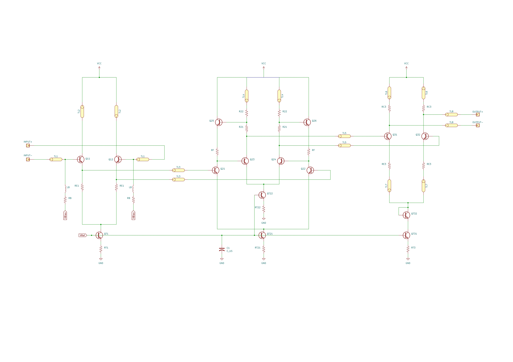
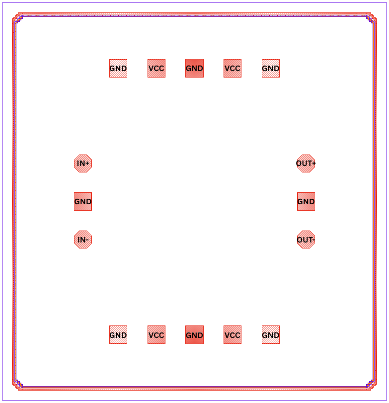

DC to 60 GHz Flat Gain Limiting Amplifier
========================================================
This document describes the specifications of the 60 GHz Flat Gain Limiting Amplifier (LA) designed for use in a 60 GHz transceiver system. The amplifier is intended to provide a flat gain response across the 60 GHz frequency band, with a focus on maintaining linearity and minimizing distortion.

.. list-table:: **Specification**
   :widths: 400 200
   :header-rows: 1

   * - Specification
     - Value
   * - Supply Voltage
     - 4 V
   * - Bandwidth
     - > 60 GHz
   * - Differential Gain
     - 15 dB
   * - Group Delay Variation
     - ±2.5 ps
   * - Differential Output Voltage
     - 800 mV p-p (< 5% THD)
   * - Power Consumption
     - 322.1 mW
   * - Area
     - 1.099 x 1.043 mm²

Circuit Diagram:
========================

   Circuit diagram of the 60 GHz Flat Gain Limiting Amplifier (LA).

Layout Image:
========================

   Layout of the 60 GHz Flat Gain Limiting Amplifier (LA).